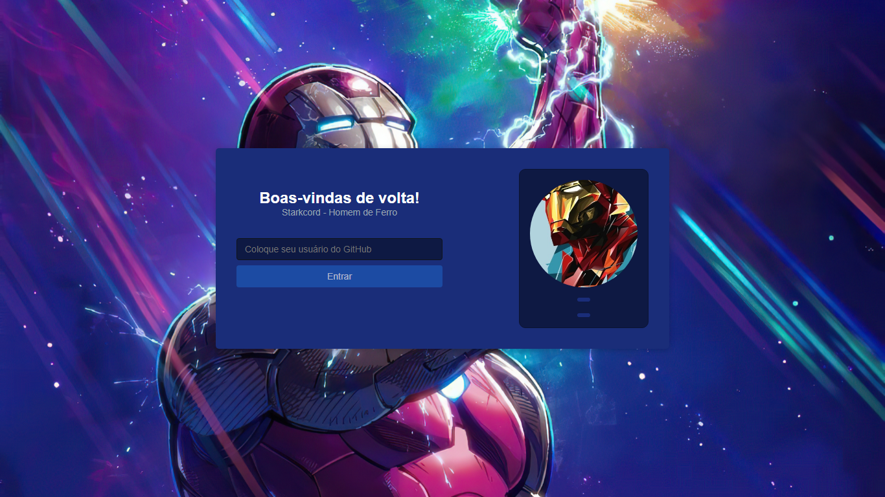
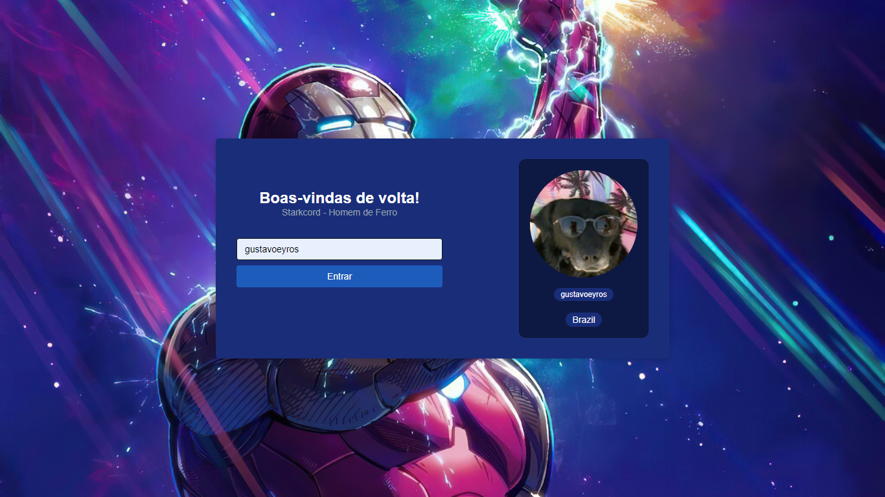
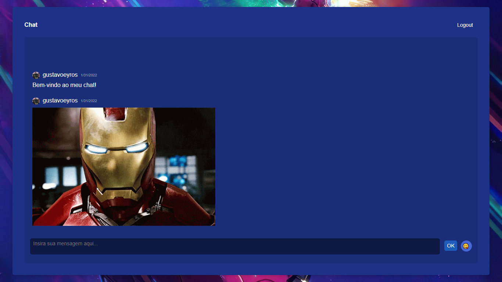

# <b>Sobre</b>
 <h3>Projeto de Discord desenvolvido na Imersão React da Alura</h3>

# <b>Site</b>
## Tela Inicial

 

## Tela inicial com informações

 

## Chat

# <b>Tecnologias</b>
Esse projeto foi desenvolvido com as seguintes tecnologias:
<ul>
<li>React</li>
<li>Next.js</li>
<li>Skynexui</li>
<li>Supabase</li>
</ul>
